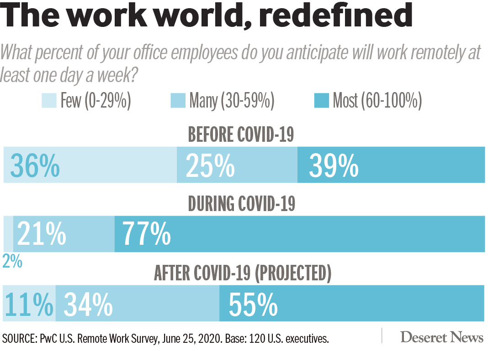

```{r setup, include=FALSE}
knitr::opts_chunk$set(echo = FALSE)
library(tidyverse)
library(flexdashboard)
library(plotly)
library(shiny)
library(readxl)
library(ggthemes)
library(scales)
library(here)
```

Improved Visual
=======================================================================

```{r import data, include=FALSE}

remote <- read_xlsx(here("data", "remote_work.xlsx"))

remote <- remote %>% 
  rename(
    time_period = `Time period`
  )

remote <- remote %>% 
  pivot_longer(
    cols = c(`<29%`, `30-59%`, `>60%`),
    names_to = "bucket",
    values_to = "percentage"
  )


```

```{r}

remote %>% 
  ggplot() +
  geom_col(aes(x = factor(time_period, levels = c("Before", "During", "After*"), ordered = TRUE), y = percentage, fill = factor(bucket, levels = c("<29%", "30-59%", ">60%"), ordered = TRUE)), width = 0.6) +
  labs(
    title = "Executives are Embracing Work-From-Home During COVID-19",
    subtitle = "Showing the % of executives that expect remote employees",
    x = element_blank(),
    y = element_blank(),
    fill = "% of Remote Employees",
    caption = "Source: PwC U.S Remote Work Survey, June 25, 2020. Base: 120 U.S. executives. * = projected"
  ) +
  theme(
    text = element_text(family = "Avenir"),
    plot.background = element_blank(),
    panel.background = element_blank(),
    axis.text.y = element_blank(),
    axis.ticks = element_blank(), 
    axis.text.x = element_text(size = 12, vjust = 0),
    plot.caption = element_text(size = 6)
  ) +
  scale_fill_manual(values = c("grey80", "lightblue", "royalblue")) +
  scale_y_continuous(breaks = c(.50, 1), labels = scales::percent_format(), expand = c(0,0)) + # expand moves the graph closer to labels
  geom_text(x = 1.01, y = .35, label = "39%", color = "lightblue", size = 5) +
  geom_text(x = 2.01, y = .73, label = "77%", color = "lightblue", size = 5) +
  geom_text(x = 3.01, y = .51, label = "55%", color = "lightblue", size = 5)
  

```


Old Visual
=======================================================================




